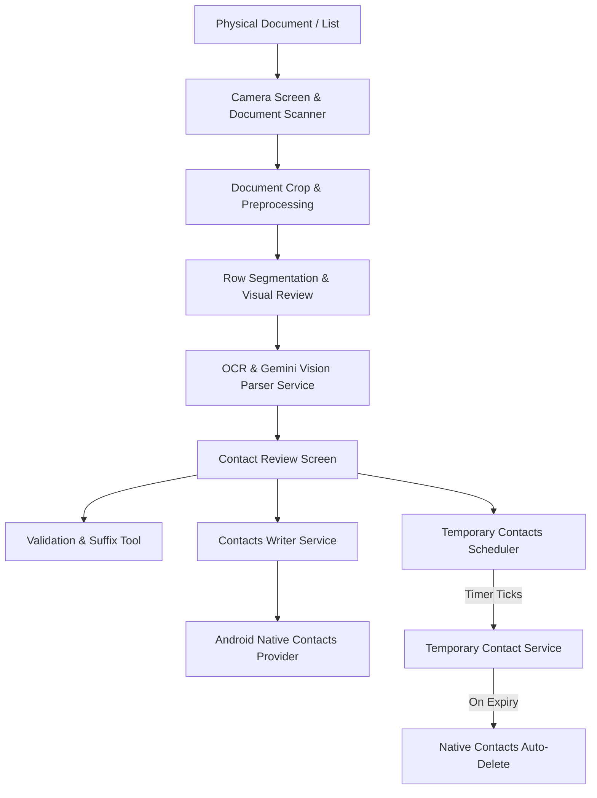

# Contact Scanner App — Complete System Architecture & Documentation

## Overview
**Contact Scanner** is an Android & Flutter application designed to digitize physical handwritten and printed contact lists (such as attendance sheets, event registers, business cards, and directories) into native smartphone contacts.

The app uses computer vision, edge preprocessing, document scanning, optical character recognition (OCR), smart validation heuristics, and automated background lifecycle management to detect names, validate 10-digit phone numbers, and auto-delete temporary contacts on a user-defined date and hour.

---

## 1. High-Level System Architecture



---

## 2. Core Workflows & Detailed Feature Breakdown

### Workflow A: Capture & Document Ingestion

#### 1. Live Camera Viewfinder (`lib/camera_screen.dart`)
- **Description**: Real-time camera viewfinder with orientation-locked preview, document alignment guides, manual flash control, and gallery image picker.
- **How It Works Under the Hood**:
  - Initializes the Flutter `camera` plugin with `ResolutionPreset.veryHigh` to maximize pixel density for handwriting clarity.
  - Locks orientation and displays a semi-transparent framing box overlaid using `CustomPaint`, giving visual guidance on how to position paper documents.
  - Exposes `FlashMode.torch` and `FlashMode.off` toggles to eliminate shadows on physical paper sheets.
  - Takes raw photographs via `controller.takePicture()` and returns local cached file paths.

#### 2. Native Document Scanner & Edge Detection (`lib/document_crop_service.dart`)
- **Description**: Automatically detects paper edges, adjusts corner angles, deskews, and flattens physical documents into a clean digital scan.
- **How It Works Under the Hood**:
  - Uses Google ML Kit's native Android Document Scanner API (`cunning_document_scanner`).
  - The native library hooks into Google Play Services ML models (`GmsDocumentScanningDelegateActivity`), processing the live camera stream to detect document quadrilaterals.
  - Computes homography transformation matrices to correct perspective distortion (keystoning), deskew rotated sheets, and crop directly along the page borders.
  - Returns a flattened 8-bit JPEG/PNG image, eliminating noisy backgrounds like desks or tabletops before any OCR or segmentation occurs.

#### 3. 3D Rotating Carousel & Wheel Main Menu (`lib/home_screen.dart`)
- **Description**: A modern rotating menu interface replacing static stacked cards with two interactive display modes: a horizontal 3D carousel and a vertical 3D cylindrical wheel.
- **How It Works Under the Hood**:
  - **Horizontal 3D Carousel (`PageView.builder`)**:
    - Uses a `PageController` configured with `viewportFraction: 0.82`, allowing neighboring cards to peek in from the left and right.
    - An `AnimatedBuilder` listens to `_pageController` and computes the exact real-time offset `diff = index - page`.
    - Applies a 3D transformation matrix:
      ```dart
      final Matrix4 matrix = Matrix4.identity()
        ..setEntry(3, 2, 0.0015) // 3D perspective
        ..rotateY(diff * -0.22)   // Rotates card back along Y axis
        ..scaleByDouble(scale, scale, 1.0, 1.0);
      ```
    - Dynamically interpolates card scale from `1.0` (center) down to `0.86` (off-center) and opacity from `1.0` down to `0.40` to create genuine optical depth.
  - **Vertical 3D Cylindrical Wheel (`ListWheelScrollView.useDelegate`)**:
    - Configures a cylindrical drum with `perspective: 0.003`, `diameterRatio: 2.0`, and `FixedExtentScrollPhysics()`.
    - Native `ListWheelScrollView` applies `magnification: 1.06` to center cards and `overAndUnderCenterOpacity: 0.42` to smoothly curve and dim cards above and below the focus point.
  - **Zero Chevron Arrows**: Trailing arrow icons (`>`) were completely eliminated, relying on focus highlights, active borders, and bottom action buttons.
  - **Mode Toggle & Dots Indicator**: An interactive header switcher allows flipping between Carousel and Wheel modes, with 4 animated pill indicator dots at the bottom.

---

### Workflow B: Image Preprocessing & Line Segmentation

#### 1. Image Preprocessing Pipeline (`lib/preprocessing_service.dart`)
- **Description**: Enhances scanned sheets by normalizing brightness, boosting contrast, and eliminating background noise.
- **How It Works Under the Hood**:
  - Uses the Dart `image` package to process raw pixels.
  - Converts full-color RGB data into an 8-bit grayscale luminance array using the ITU-R BT.601 standard:
    $$\text{Luminance} = 0.299 \times R + 0.587 \times G + 0.114 \times B$$
  - Runs adaptive contrast stretching and thresholding ($L < 185$) to cleanly separate dark handwritten pen ink from gray shadows, paper wrinkles, and off-white paper textures.

#### 2. Row Segmentation & Name/Number Grouping (`lib/row_segmentation_service.dart`)
- **Description**: Automatically detects and groups individual handwritten contact entries ("Name - Phone") into isolated bounding boxes.
- **How It Works Under the Hood (How Names & Numbers are Grouped into Boxes)**:
  1. **Horizontal Projection Profiling**:
     - Computes a 1D density histogram $P[y]$ across the image height by summing all dark ink pixels on each horizontal scanline $y$.
  2. **Continuous Text Span Identification**:
     - Scans through $P[y]$ and identifies continuous bands of rows where the ink pixel count meets or exceeds a minimum threshold:
       $$\text{minInkThreshold} = \max(6, \text{width} \times 0.004)$$
     - Enforces a minimum line height filter ($\ge 1.2\% \times \text{height}$) to discard stray pen specks or margin lines.
  3. **Ascender/Descender & Multi-Line Gap Merging**:
     - Handwriting contains ascenders ('b', 'd', 'h', 't') and descenders ('g', 'j', 'p', 'y') that often create small dips in ink projection.
     - Spans separated by a vertical gap smaller than $1.8\% \times \text{height}$ are merged together into a single unified row box. This guarantees multi-line names and corrections remain inside the same contact bounding box.
  4. **Horizontal Bounding Box Tightening**:
     - For each detected vertical span, scans columns from left to right to find the absolute leftmost ($\text{minX}$) and rightmost ($\text{maxX}$) ink pixels.
     - Adds a dynamic vertical padding (12% of row height + 10px) and horizontal padding (2% of width + 10px) to prevent slicing off edge characters.
  5. **Data Structure & Crop Generation**:
     - Emits `RowCropData` containing both absolute pixel coordinates and normalized coordinates $[0.0 \dots 1.0]$ (`normalizedRect`), alongside isolated sliced images (`row_1.jpg`, `row_2.jpg`).

#### 3. Interactive Visual Inspection (`lib/review_screen.dart` & `lib/row_overlay_painter.dart`)
- **Description**: Displays the scanned sheet with neon bounding boxes overlaid on every detected contact row, allowing users to verify box grouping before running OCR.
- **How It Works Under the Hood**:
  - `RowOverlayPainter` extends Flutter's `CustomPainter` to draw bounding boxes directly over the rendered image canvas.
  - Multiplies `normalizedRect` by the canvas render dimensions, drawing a glowing cyan border (`Color(0xFF00E5FF)`) with rounded corners around each row.
  - Renders row index tags (e.g. `Row 1`, `Row 2`) above each box.
  - Users can inspect individual cropped row slices in a horizontal thumbnail reel below the image to confirm handwriting legibility before parsing.

---

### Workflow C: Text Recognition & Contact Parsing

#### 1. AI Multimodal Vision Parsing (`lib/vision_parser_service.dart`)
- **Description**: Uses multimodal vision intelligence (Google Gemini `gemini-3.5-flash-lite`) to parse handwritten text, separate names and phone numbers, and output structured JSON.
- **How It Works Under the Hood**:
  - Reads the scanned document or cropped row slices, base64 encodes the bytes, and constructs an HTTP POST request to the Gemini Vision REST API endpoint.
  - Sends a low-temperature configuration (`temperature: 0.1`) with a specialized system prompt enforcing a strict JSON schema: `[{"name": "...", "phone": "..."}]`.
  - Parses the raw model response, defensively strips markdown code fences (` ```json `), and converts the output into structured contact objects.

#### 2. Strikethrough Prevention & Correction Pairing (`lib/vision_parser_service.dart`)
- **Description**: Intelligently identifies crossed-out or scratched-out names on physical paper, ignores the struck-out text, and correctly extracts the re-written correction without duplicating entries.
- **How It Works Under the Hood (What Was Done to Achieve Strikethrough Prevention)**:
  1. **Multimodal Spatial Prompt Guidance**:
      - Configured with deterministic inference (`temperature: 0.0`) to avoid hallucinations and maintain consistency.
      - The AI model prompt specifically instructs:
        - *"FULL-WORD STRIKETHROUGH: If a name or number is struck through or scribbled over (e.g. a scribbled 'Samu' followed by clean 'Samu'), IGNORE the scribbled/struck-out version completely. Extract only the clean, non-struck-out text ('Samu')."*
        - *"INTRA-WORD & INLINE LETTER STRIKETHROUGH: When individual letters or syllables inside a word are struck through (e.g. 'Gamma' + struck-out 'raka' + 'ra'), COMPLETELY DROP the struck-out letters ('raka') and merge the clean parts into the intended word ('Gammara'). NEVER output 'Gammarakara' or 'Gammaraka'."*
        - *"REWRITTEN CORRECTIONS: When a struck-out name has a replacement written near it (above, below, or beside), extract ONLY the clean correction."*
        - *"STRUCK-OUT PHONE NUMBERS: If digits are struck through and new digits are written next to or below them, include ONLY the valid, non-struck-out digits."*
  2. **Deterministic Code-Level Regex Sanitization (`_cleanName`)**:
     - Removes markdown strikethrough syntax: `RegExp(r'~~.*?~~')`.
     - Removes parenthetical and bracketed annotations: `RegExp(r'\(.*?(crossed|struck|strike|scratched).*?\)')` and `RegExp(r'\[.*?(crossed|struck|strike|scratched).*?\]')`.
     - Multi-line resolution: If the OCR returns multi-line text (e.g., struck-out word on line 1 and correction on line 2), it splits by line, discards lines starting with `~~`, and selects the clean replacement line.
     - Strips leading/trailing punctuation noise (`~`, `-`, `/`, `,`, `.`).
  3. **Phone-Keyed Deduplication & Overwrite Logic**:
     - If the model emits both the struck-out name and the replacement name on separate lines with the same phone number:
       ```dart
       if (contacts.isNotEmpty && contacts.last['phone'] == phone) {
         // Replaces previous struck-out entry with the cleaner correction
         contacts.last['name'] = name;
       }
       ```
     - Guarantees zero duplicate contacts or orphan entries in the final list.

#### 3. Offline Handwriting Recognition (`lib/offline_crnn_service.dart`)
- **Description**: Fully offline on-device OCR model for transcribing handwriting without sending images over the network.
- **How It Works Under the Hood**:
  - Uses `flutter_onnxruntime` to execute an embedded CRNN (Convolutional Recurrent Neural Network) + CTC (Connectionist Temporal Classification) deep learning model directly on the phone's CPU/NPU.
  - Resizes cropped row images to fixed height (32px), normalizes pixel tensor values to $[-1.0 \dots 1.0]$, and runs CTC greedy decoding to output character sequences offline.

---

### Workflow D: Contact Verification & Review

#### 1. Interactive Contact Cards (`lib/contact_review_screen.dart`)
- **Description**: Review screen displaying detected contacts in an editable list with swipe-to-delete gestures and manual addition capabilities.
- **How It Works Under the Hood**:
  - Renders a `ListView.builder` where each item is controlled by dedicated `TextEditingController` instances for both Name and Phone.
  - Wrapped in Flutter `Dismissible` widgets so users can swipe any false-positive card to remove it instantly.
  - "Add Contact" button inserts an empty card at index 0 and focuses the name field for immediate entry.

#### 2. 10-Digit Receding / Exceeding Validation (`lib/contact_review_screen.dart`)
- **Description**: Live validation engine that flags telephone numbers that have fewer or more than 10 digits, contain letters, or look like placeholder noise.
- **How It Works Under the Hood**:
  - **`_phoneWarning(phone)` Algorithm**:
    1. Strips out country code prefixes (e.g. `+91`, `+1`) and formatting characters (`-`, spaces, `()`).
    2. Extracts pure numeric digits: `digits = raw.replaceAll(RegExp(r'[^0-9]'), '')`.
    3. **Receding Warning (< 10 digits)**: If `digits.length < 10`, returns:
       `"Phone has ${digits.length} digits (< 10) — number may be incomplete"`.
    4. **Exceeding Warning (> 10 digits)**: If `digits.length > 10`, returns:
       `"Phone has ${digits.length} digits (> 10) — exceeds standard 10 digits"`.
    5. **OCR Misread Check**: If letters exist in the phone string (`RegExp(r'[a-zA-Z]')`), returns `"Contains letters — likely an OCR misread"`.
    6. **Dummy Number Check**: Tests for repeated single digits (e.g. `0000000000` or `9999999999`) using backreferenced regex `RegExp(r'^(\d)\1{9}$')`.
  - **`_nameWarning(name)` Algorithm**:
    - Flags 1-character names, names where numbers constitute $>40\%$ of characters, or names containing OCR noise characters (`|`, `\`, `^`, `~`, `<>`, `{}`, `[]`, `_`).
  - **Visual Warning Feedback**:
    - Cards with warnings display an amber border (`Color(0xFFE68A00)`), an amber warning triangle icon, and a clickable badge. Tapping opens an explanatory tooltip bottom sheet explaining the specific issue so the user can correct it before saving.

#### 3. Batch Suffix & Event Tagging Tool (`lib/contact_review_screen.dart`)
- **Description**: Allows appending an organization, company, or event label across all contacts simultaneously.
- **How It Works Under the Hood**:
  - A global suffix text field tracks the user's label (e.g. `- College2026`, `- TechExpo`).
  - Each contact card includes a `_skipSuffix[i]` checkbox.
  - During phonebook writing, if `_skipSuffix[i]` is false, the final name is composed as:
    ```dart
    final finalName = suffix.isNotEmpty ? '$name $suffix' : name;
    ```

---

### Workflow E: Temporary Contacts & Scheduled Expiration

#### 1. Batch Temporary Toggle & Global Expiry Scheduling (`lib/contact_review_screen.dart`)
- **Description**: A master toggle switch in the review header that applies temporary status and a global expiration date/time to all contacts at once.
- **How It Works Under the Hood**:
  - Maintains `_allTemporary` boolean state. Toggling updates every contact's `_isTemporary[i]` in `setState()`.
  - Defaults global expiry to 24 hours from the current time.
  - Each card also maintains an individual toggle, allowing users to keep VIPs or specific contacts permanent while making the rest temporary.

#### 2. Custom Date & Hour Picker Modal (`_pickCustomDateAndHour`)
- **Description**: Bottom sheet modal allowing selection of quick testing presets or exact calendar date and hour/minute for auto-deletion.
- **How It Works Under the Hood**:
  - Provides instant preset chips for rapid testing:
    - `15s Test` (`DateTime.now().add(Duration(seconds: 15))`)
    - `1m Test` (`DateTime.now().add(Duration(minutes: 1))`)
    - `+1 Hour`, `+1 Day`, `+1 Week`
  - "Choose Custom Date & Hour" opens Flutter's native `showDatePicker` followed immediately by `showTimePicker`, combining the selections into a single `DateTime(year, month, day, hour, minute)`.
  - Can be applied globally to all contacts or individually to a specific contact card.

#### 3. Real-Time Countdown Monitor (`lib/temporary_contacts_screen.dart`)
- **Description**: Dedicated screen showing all active temporary contacts with live countdown badges.
- **How It Works Under the Hood**:
  - Initializes a periodic 1-second `Timer.periodic(Duration(seconds: 1))` in `initState()`.
  - On every tick, calls `setState()` to recalculate `expiryDateTime.difference(DateTime.now())`.
  - Formats duration dynamically:
    - If $< 60$ seconds: `"14s remaining"` (highlighted with urgent red/amber badge)
    - If $< 60$ minutes: `"42m remaining"`
    - If $> 1$ day: `"2d 6h remaining"`
  - Provides buttons to delete any single temporary contact immediately or clear all scheduled timers.

---

### Workflow F: Native Phonebook Write & Automated Deletion

#### 1. Native Contacts Insertion & Phone-Only Duplicate Prevention (`lib/contacts_writer_service.dart` -> `MainActivity.kt`)
- **Description**: Writes validated contacts into the Android device's native contacts provider while selectively skipping duplicate phone numbers (allowing identical contact names).
- **How It Works Under the Hood**:
  - **Phone-Only Uniqueness Enforcement**:
    - Scanned contacts often share common names (e.g. "Rahul", "John"). The system explicitly permits duplicate names with different numbers.
    - Only duplicate phone numbers are skipped.
    - **Dual-Layer Duplicate Detection**:
      1. *Batch-Level Normalization*: Normalizes phone strings to 10-digit numeric keys (`normalizePhoneKey`). Identifies and skips duplicate numbers occurring multiple times in the same document scan.
      2. *Native Phonebook Check (`checkPhoneExists`)*: Queries Android via MethodChannel. Android executes a three-stage check:
         - Stage 1: `ContactsContract.PhoneLookup.CONTENT_FILTER_URI` (handles standard system formatting).
         - Stage 2: Direct query on `CommonDataKinds.Phone.CONTENT_URI` by exact number.
         - Stage 3: Suffix match on the last 10 digits to resolve country code variations (`+91` vs local prefix).
  - In `MainActivity.kt`:
    1. **Google Account Discovery**: Queries `AccountManager.get(context).getAccountsByType("com.google")` to identify the user's primary synced Google account. This prevents Android's `"cannot add local contacts"` exception on modern Android versions (Android 11-16).
    2. **ContentProvider Batch Execution**: Constructs an `ArrayList<ContentProviderOperation>`:
       - Operation 1: Creates new `RawContact` linked to the discovered Google account.
       - Operation 2: Inserts `CommonDataKinds.StructuredName` with `DISPLAY_NAME`.
       - Operation 3: Inserts `CommonDataKinds.Phone` with `NUMBER` and `TYPE_MOBILE`.
    3. Executes all operations atomically using `contentResolver.applyBatch(ContactsContract.AUTHORITY, ops)`.
  - For every skipped contact, emits a `SkippedContactInfo` model containing `name`, `phone`, and `reason`.

#### 2. Persistent Local Registry (`lib/temporary_contact_service.dart`)
- **Description**: Local disk registry ensuring scheduled expirations survive app restarts and device reboots.
- **How It Works Under the Hood**:
  - Uses `path_provider` to access the application documents directory and writes `temporary_contacts_registry.json`.
  - Serializes each scheduled contact with its name, phone, and ISO-8601 expiry timestamp.
  - On application startup (`TemporaryContactService().init()`), reads `temporary_contacts_registry.json`, deserializes all pending contacts, and immediately triggers an expiration check.

#### 3. Automated Expiration & Deletion Engine (`MainActivity.kt`)
- **Description**: Background daemon that automatically removes expired contacts from the phonebook without requiring user interaction.
- **How It Works Under the Hood**:
  - A 1-second periodic background timer checks all scheduled contacts:
    ```dart
    if (DateTime.now().isAfter(contact.expiryDateTime)) {
      await _deleteNativeContact(contact);
    }
    ```
  - Calls MethodChannel `deleteContact` with `name` and `phone`.
  - In `MainActivity.kt`:
    1. Queries `ContactsContract.CommonDataKinds.Phone.CONTENT_URI` filtering by matching phone number and display name to obtain the specific `RAW_CONTACT_ID`.
    2. Builds the delete URI specifying `CALLER_IS_SYNCADAPTER=true`:
       ```kotlin
       val deleteUri = ContactsContract.RawContacts.CONTENT_URI.buildUpon()
           .appendQueryParameter(ContactsContract.CALLER_IS_SYNCADAPTER, "true")
           .build()
       ```
       *(Setting `CALLER_IS_SYNCADAPTER=true` forces Android to physically purge the contact row from the database rather than just marking it with a deleted flag).*
    3. Executes `contentResolver.delete(deleteUri, "${ContactsContract.RawContacts._ID} = ?", arrayOf(rawContactId))`.
    4. Removes the contact from `temporary_contacts_registry.json` and notifies UI listeners.

#### 4. Save Success Screen & Skipped Contact Inspector (`lib/save_success_screen.dart`)
- **Description**: Confirmation screen displaying total contacts saved, breakdown statistics, and an interactive viewer to inspect skipped duplicate contacts.
- **How It Works Under the Hood**:
  - Fully styled to the `#0E1118` dark navy theme with high-contrast text and green confetti animation.
  - **Summary Breakdown**: Displays Total Scanned, Successfully Saved, Skipped (Duplicate Numbers), and Failed to Save.
  - **Option to See Skipped Contacts**:
    - *Inline Expandable Card*: Users can tap "See Names" / "Hide" on the skipped card to view contacts directly in-line with initials, name, duplicate phone number, and reason tag.
    - *Modal Bottom Sheet*: Tapping "View Names" in the summary table slides up a dedicated bottom sheet with scrollable list and duplicate reason tags.
  - Provides direct `"Scan Another Page"` and `"Open Contacts App"` navigation intents.

---

### Workflow G: Brand Identity & Visual Asset Architecture

#### 1. Origami Contact & Scanner Viewfinder Logo (`assets/logo.png`)
- **Description**: The signature logo combines physical paper artistry with digital computer vision framing.
- **Visual Design & Symbolism**:
  - **Origami Paper Bust**: A low-poly, origami-folded white paper human figure representing physical contact sheets, physical paper registers, and human identity.
  - **Cyan Scanner Corner Brackets**: Four glowing turquoise/cyan (`#00E5FF`) viewfinder brackets enclosing the subject, symbolizing the app's real-time optical capture, document segmentation, and bounding box targeting.
  - **Matte Dark Canvas**: Deep dark background (`#0E1118`) creating an ultra-clean contrast matching the app's dark navy/slate theme.
- **How It Works Under the Hood & Asset Pipeline**:
  - **Master High-Resolution Asset**: Stored at `assets/logo.png` (1024x1024 PNG), declared in `pubspec.yaml`.
  - **In-App Visual Integration**:
    - `HomeScreen`: Featured as a 36x36 rounded badge alongside the main dashboard title.
    - `CameraScreen`: Displayed in the top-left translucent frosted glass viewfinder badge (22x22).
    - `ContactReviewScreen`: Positioned in the AppBar (34x34) beside contact count statistics.
  - **Native Android Launcher Icons**:
    - Downsampled from the master 1024x1024 image using Lanczos interpolation across all Android density buckets:
      - `mipmap-mdpi`: 48x48
      - `mipmap-hdpi`: 72x72
      - `mipmap-xhdpi`: 96x96
      - `mipmap-xxhdpi`: 144x144
      - `mipmap-xxxhdpi`: 192x192
    - Linked in `AndroidManifest.xml` via `android:icon="@mipmap/ic_launcher"`, delivering crisp launcher branding on physical devices.

---

### Workflow H: User API Key Management & Settings

#### 1. Dedicated Settings Screen (`lib/settings_screen.dart`)
- **Description**: Allows users to configure their own Google Gemini API key directly within the app interface.
- **How It Works Under the Hood**:
  - Built with the dark navy/slate design system (`#0E1118` scaffold, `#161B26` card backgrounds, cyan `#00E5FF` highlights).
  - Includes a step-by-step guidance card with a clickable button launching `https://aistudio.google.com/app/apikey` via `url_launcher`.
  - Features an obscured text field (`obscureText: true`) with an eye visibility toggle button, clear button, and paste shortcut.
  - Displays currently saved key status (masked preview: `AIzaSy...XXXX`) and a button to remove or replace stored keys.

#### 2. Key Priority & Local Storage (`lib/api_key_service.dart`)
- **Description**: Centralized service managing API key resolution and persistent storage.
- **How It Works Under the Hood**:
  - Uses `shared_preferences` to persist user-supplied API keys under key `gemini_user_api_key`.
  - Resolution hierarchy:
    1. User key in `SharedPreferences` (highest priority).
    2. Fallback key defined in `.env` (`flutter_dotenv`).
    3. Throws a helpful user-facing exception directing to Settings if no key is present.

---

## 3. Directory & File Breakdown

| File | Purpose | Key Technical Details |
|---|---|---|
| [`lib/main.dart`](file:///j:/napp/lib/main.dart) | App entry point & theme | Sets up dark navy/slate theme (`#0E1118`), initializes cameras, and launches `HomeScreen`. |
| [`lib/home_screen.dart`](file:///j:/napp/lib/home_screen.dart) | Redesigned Main Menu | Houses the 3D rotating horizontal carousel (`PageView`) & vertical 3D wheel (`ListWheelScrollView`) with logo badge. |
| [`lib/camera_screen.dart`](file:///j:/napp/lib/camera_screen.dart) | Live Camera Viewfinder | Full-screen preview with document guides, flash torch, gallery import, and top logo badge. |
| [`lib/document_crop_service.dart`](file:///j:/napp/lib/document_crop_service.dart) | Document Scanner Service | Integrates ML Kit Document Scanner for automatic edge detection and flattening. |
| [`lib/preprocessing_service.dart`](file:///j:/napp/lib/preprocessing_service.dart) | Image Enhancement | BT.601 luminance conversion, contrast stretching, and adaptive binarization. |
| [`lib/row_segmentation_service.dart`](file:///j:/napp/lib/row_segmentation_service.dart) | Line Item Segmentation | Horizontal projection profiling, ascender/descender merging, and padding bounds. |
| [`lib/review_screen.dart`](file:///j:/napp/lib/review_screen.dart) | Bounding Box Review | Interactive screen with neon bounding boxes overlaid on detected rows. |
| [`lib/row_overlay_painter.dart`](file:///j:/napp/lib/row_overlay_painter.dart) | Bounding Box Canvas Painter | `CustomPainter` rendering normalized bounding boxes over document images. |
| [`lib/vision_parser_service.dart`](file:///j:/napp/lib/vision_parser_service.dart) | Gemini Vision OCR & Parser | Multimodal AI OCR (`gemini-3.5-flash-lite`), strikethrough detection, correction pairing, and regex cleaning. |
| [`lib/settings_screen.dart`](file:///j:/napp/lib/settings_screen.dart) | Settings & API Key Screen | Dark navy UI, step-by-step AI Studio instructions, secure input field with visibility toggle. |
| [`lib/api_key_service.dart`](file:///j:/napp/lib/api_key_service.dart) | API Key Storage & Fallback | `SharedPreferences` persistence for user API keys with fallback to `.env`. |
| [`lib/offline_crnn_service.dart`](file:///j:/napp/lib/offline_crnn_service.dart) | Offline Handwriting Model | On-device ONNX Runtime CRNN model for offline handwriting recognition. |
| [`lib/contact_review_screen.dart`](file:///j:/napp/lib/contact_review_screen.dart) | Contact Review & Verification | Editable contact cards, 10-digit warnings, batch suffix tool, temporary scheduling, and AppBar logo. |
| [`lib/temporary_contacts_screen.dart`](file:///j:/napp/lib/temporary_contacts_screen.dart) | Temporary Contacts Details | Real-time second-by-second countdown screen with manual deletion controls. |
| [`lib/temporary_contact_service.dart`](file:///j:/napp/lib/temporary_contact_service.dart) | Background Expiry Engine | JSON disk registry persistence and 1-second periodic background timer. |
| [`lib/contacts_writer_service.dart`](file:///j:/napp/lib/contacts_writer_service.dart) | MethodChannel & Deduplication | Phone-only duplicate filtering, batch key normalization, Google account contact saving. |
| [`android/app/src/main/kotlin/.../MainActivity.kt`](file:///j:/napp/android/app/src/main/kotlin/com/example/contact_scanner/MainActivity.kt) | Native Android Kotlin Plugin | `AccountManager` Google discovery, ContentProvider batch ops, `checkPhoneExists` PhoneLookup. |
| [`lib/save_success_screen.dart`](file:///j:/napp/lib/save_success_screen.dart) | Completion & Skipped Inspector | Dark navy layout, confetti celebration, inline expandable skipped list, and modal name viewer. |
| [`assets/logo.png`](file:///j:/napp/assets/logo.png) | Master App Logo & Branding | 1024x1024 high-res origami contact silhouette with neon cyan scanner brackets on dark slate. |
| `android/app/src/main/res/mipmap-*/ic_launcher.png` | Android App Launcher Icons | Multi-density Android home screen icons downsampled with Lanczos interpolation. |
| [`test/duplicate_number_test.dart`](file:///j:/napp/test/duplicate_number_test.dart) | Unit Tests: Deduplication | Validates 10-digit phone key normalization and `SkippedContactInfo` modeling. |
| [`test/temporary_contact_test.dart`](file:///j:/napp/test/temporary_contact_test.dart) | Automated Unit Tests | Unit tests validating expiration calculations, batch scheduling, and JSON parsing. |

---

## 4. Key Capabilities & Technical Highlights
- **Phone-Only Duplicate Prevention**: Only duplicate telephone numbers are skipped during save operations; contacts sharing common names with different numbers are preserved and written to native phone contacts.
- **Interactive Skipped Contact Inspector**: When duplicate numbers are detected, users can inspect the skipped contacts inline or in a modal bottom sheet showing names, phone numbers, and duplicate source reasons.
- **Origami & Scanner Brand Identity**: Distinctive paper-craft silhouette with neon cyan viewfinder corner brackets symbolizing the paper-to-digital contact conversion pipeline.
- **User-Configurable Gemini API Key**: In-app Settings screen allowing users to input their personal Google AI Studio keys, persisted securely via `SharedPreferences`.
- **Strikethrough Prevention**: Automatically ignores crossed-out names/numbers on physical paper and extracts nearby rewritten corrections without creating duplicate entries.
- **Accurate Row/Box Grouping**: Uses horizontal projection profiling and gap merging to bundle multi-line names and handwriting ascenders/descenders into tight bounding boxes.
- **10-Digit Receding & Exceeding Warnings**: Proactively alerts users if phone numbers are incomplete ($<10$ digits) or overly long ($>10$ digits), preventing corrupted address book entries.
- **3D Rotating Carousel & Wheel**: Modern fluid menu with genuine optical depth, scaling center cards to 100% and fading off-center cards in 3D perspective without chevron arrows.
- **Self-Cleaning Temporary Contacts**: Contacts scheduled for conferences, deliveries, or short-term projects automatically expire and delete themselves natively from the user's phonebook.
- **Zero-Loss Persistence**: Expiration registry is saved locally to JSON on disk, ensuring schedules persist across app restarts and phone reboots.
